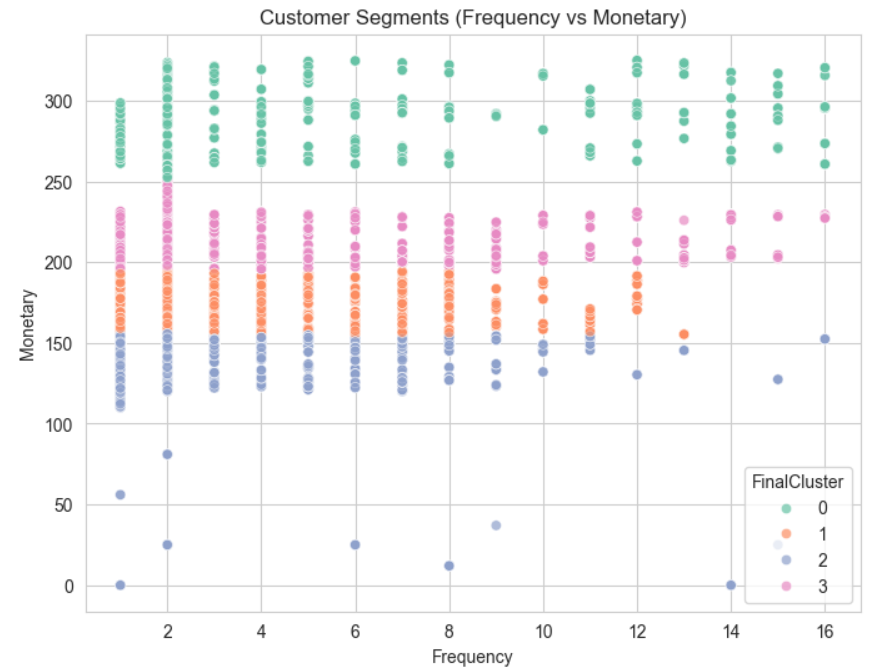
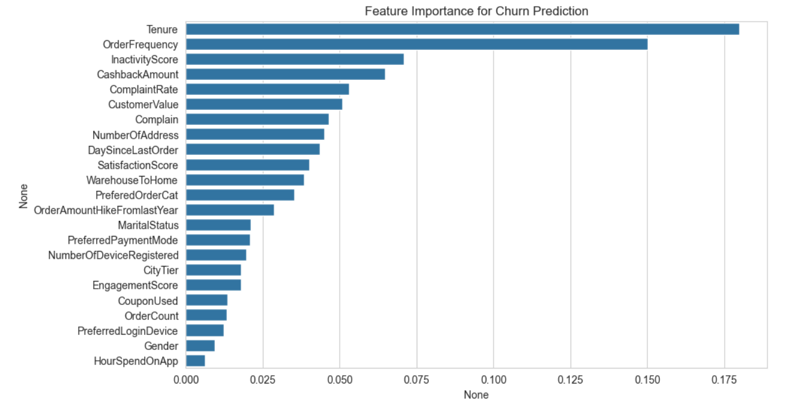
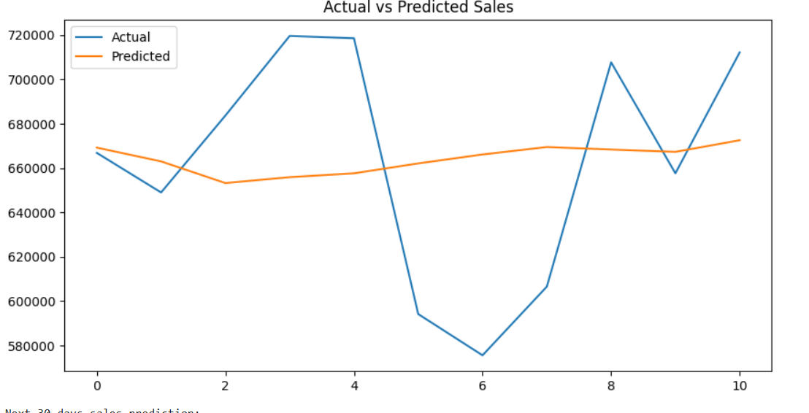

# AI-Powered E-Commerce Intelligence Platform

An end-to-end **machine learning powered analytics platform for e-commerce businesses**.  
This system analyzes customer behavior, predicts churn risk, forecasts future sales, and recommends similar products using machine learning, deep learning, and NLP techniques.

The platform integrates multiple AI models into a single **interactive Streamlit dashboard** to provide real-time business insights.

---

# Project Overview

This project demonstrates a **complete data science pipeline**:

- Data Cleaning
- Exploratory Data Analysis
- Feature Engineering
- Machine Learning Modeling
- Deep Learning Time Series Forecasting
- NLP-based Recommendation System
- Interactive Business Dashboard

The system processes **customer, product, and transaction datasets** to extract meaningful insights and predictions.

---

# Key Features

### Customer Segmentation
Customers are grouped based on purchasing behavior using **RFM analysis (Recency, Frequency, Monetary)** and **K-Means clustering**.

### Churn Prediction
A **Random Forest classification model** predicts the probability of a customer leaving the platform.

### Sales Forecasting
A **deep learning LSTM time series model** predicts future sales revenue using historical transaction data.

### Product Recommendation
A **content-based recommendation system** built using **TF-IDF vectorization and cosine similarity** suggests similar products.

### Interactive Dashboard
All models are integrated into a **Streamlit analytics dashboard** for easy interaction and visualization.

---

# Screenshots

## Customer Segmentation


## Churn Prediction Feature Importance


## Sales Forecasting (Actual vs Predicted)


---

# Tech Stack

**Programming Language**

Python

**Data Processing**

- pandas
- numpy

**Machine Learning**

- scikit-learn
- Random Forest
- K-Means Clustering

**Deep Learning**

- TensorFlow
- LSTM Networks

**Natural Language Processing**

- TF-IDF Vectorization
- Cosine Similarity

**Visualization**

- matplotlib
- seaborn
- plotly

**Deployment**

- Streamlit

---

# Machine Learning Models

| Module | Algorithm Used |
|------|------|
Customer Segmentation | K-Means Clustering |
Churn Prediction | Random Forest |
Sales Forecasting | LSTM (Deep Learning) |
Product Recommendation | TF-IDF + Cosine Similarity |

---

# How to Run the Project

### 1 Clone the repository

```bash
git clone https://github.com/yourusername/ecommerce-ai-platform.git
